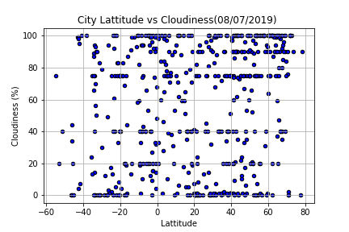
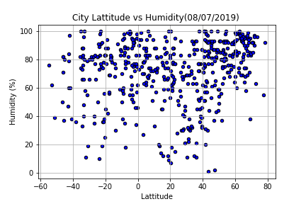

## Weather Analysis
* Temperature increases as we approach the equator. However, temperature peaks at around 20-22 degrees latitude, not exactly at the         equatorial line. This may be due to the Earth's tilt in the axis known as obliquity.
 
 
 
* There is alomost no correlation between cloudiness and latitude. It is almost distributed all around the globe.

 
 
* Even the correlation between latitude and wind speed is very weak.
* Humidity is consistently higher in the tropic but still not a strong corealtion with lattitude.

 
